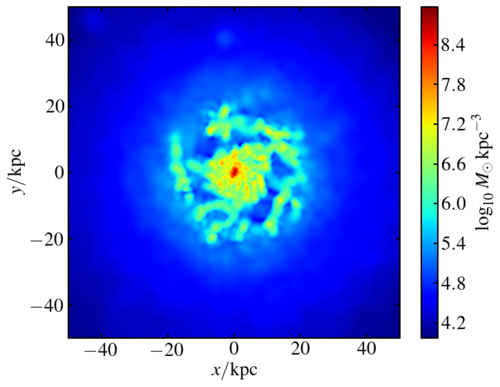
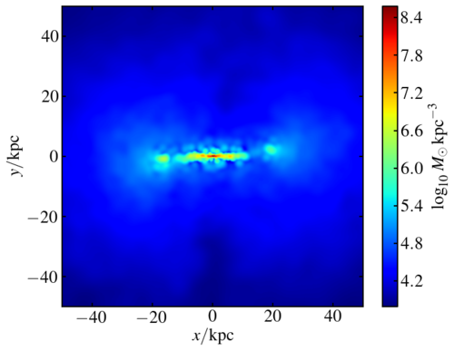
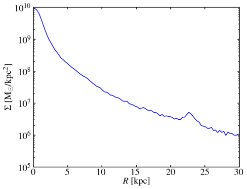

.. snapshot_manipulation tutorial

.. _snapshot_manipulation: 

Basic snapshot manipulation
===========================

After you've had a first peek at your data in the :ref:`data-access`
tutorial, you will likely want to massage it into a shape that will
let you actually do some more specific analysis (and make pretty
pictures).

`Pynbody` includes some essential tools that allow you to perform some
basic manipulations. Some of these are included in the low-level
:class:`pynbody.snapshot.SimSnap` class, others can be found in two
analysis modules :mod:`pynbody.analysis.angmom` and
:mod:`pynbody.analysis.halo`. This brief walkthrough will show you
some of their capabilities.

Centering the snapshot
----------------------

After loading in the data, we will want to center it on the main halo
to analyze its contents.

.. ipython::

 In [1]: import pynbody

 In [2]: s = pynbody.load('testdata/g15784.lr.01024.gz')

This loads the snapshot ``s``. Now we load the halos and center on the
main halo (see the :ref:`halo_tutorial` tutorial for more detailed
information on how to deal with halos):

.. ipython::

 In [3]: h = s.halos()
 
 In [4]: pynbody.analysis.halo.center(h[1],mode='hyb')

The halos of ``s`` are now loaded in ``h`` and ``h[1]`` yields the
:class:`~pynbody.snapshot.SubSnap` of `s` that corresponds to
halo 1. We pass ``h[1]`` to the function
:func:`~pynbody.analysis.halo.center` to center the *entire* snapshot
on the largest halo. We specify the mode of centering using the
keyword ``mode`` - here, we used `hyb`, which stands for hybrid: the
snapshot is first centered on the particle with the lowest potential,
and this guess is then refined using the `shrinking sphere` method
(see the documentation for :func:`~pynbody.analysis.halo.center` for
more details).

We can take a look at what we have at the center now: 

.. ipython::

 In [5]: s.physical_units()
 
 In [9]: pynbody.plot.image(s.g, width=100)

Which gives something like: 

.. note:: see the :doc:`pictures` tutorial for more examples of making images.

Aligning the Snapshot
---------------------

In this example, the disk seems to be aligned more or less face-on,
but lets say we want it edge-on:

.. ipython::

 In [12]: pynbody.analysis.angmom.sideon(h[1], cen=(0,0,0))

 In [13]: pynbody.plot.image(s.g, width=100)

Note that the function :func:`~pynbody.analysis.angmom.sideon` will
actually by default center the snapshot first, unless you feed it the
``cen`` keyword. We did that here since we already centered it
earlier. It then calculates the angular momentum vector in a sphere
around the center and rotates the snapshot such that the angular
momentum vector is parallel to the `y`-axis. If, instead, you'd like
the disk face-on, you can call the equivalent
:func:`pynbody.analysis.angmom.faceon` instead. Alternatively, if you
want to just rotate the snapshot by arbitrary angles, the
:class:`~pynbody.snapshot.SimSnap` class includes functions
:func:`~pynbody.snapshot.SimSnap.rotate_x`,
:func:`~pynbody.snapshot.SimSnap.rotate_y`,
:func:`~pynbody.snapshot.SimSnap.rotate_z` that rotate the snapshot
about the respective axes. We can use this to rotate the disk into a
face-on orientation:

.. ipython::

 In [21]: s.rotate_x(90)

.. note:: All of the snapshot manipulation functions described above operate on the *entire* simulation, even if you only pass in a :class:`~pynbody.snapshot.SubSnap`. So, for example, ``s.g.rotate_x(90)`` is equivalent to ``s.rotate_x(90)``.

In the face-on orientation, we may wish to make a profile: 

.. ipython:: 

 In [23]: p = pynbody.analysis.profile.Profile(h[1].s, min = 0.01, max = 30)
 
 In [25]: import matplotlib.pylab as plt

 In [25]: plt.plot(p['rbins'], p['density'])

 In [26]: plt.semilogy()

 In [28]: plt.xlabel('$R$ [kpc]')

 In [29]: plt.ylabel('$\Sigma$ [M$_\odot$/kpc$^2$]')

See the :doc:`profile` tutorial or the
:class:`~pynbody.analysis.profile.Profile` documentation for more
information on available options.

